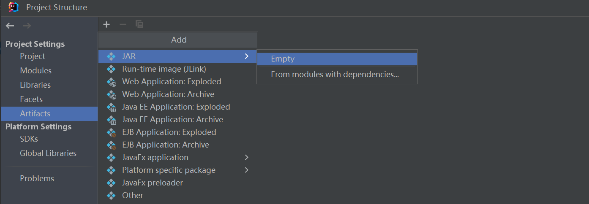
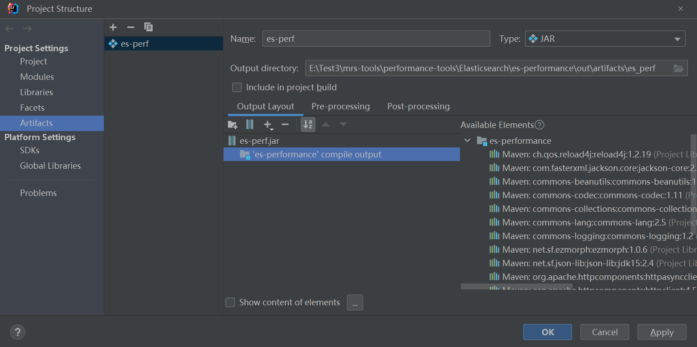

一、 生成es-perf.jar
1. 使用IDEA打开mrs-tools/performance-tools/Elasticsearch/es-performance工程。
2. 选择“File > Project Structure...”。选择“Artifacts”，单击“+”并选择“Jar > Empty”。

3. 修改Name为自定义的名字，如es-perf。
4. 选中“Output Layout”，右击右侧“Available Elements”中的“'es-performance' compile output”，单击“Put Into Output Root”。单击“Apply”保存修改，然后单击“OK”退出。

5. 选择“Build > Build Artifacts...”。在弹出框中选择“es-perf > Build”，开始编译Artifact。
6. 随后在Artifacts配置的“Output directory”目录下获取es-perf.jar。

二、生成运行依赖的libs
进入es-performance目录，在Windows命令提示符窗口执行以下命令生成运行依赖的libs。
mvn dependency:copy-dependencies -DoutputDirectory=libs
