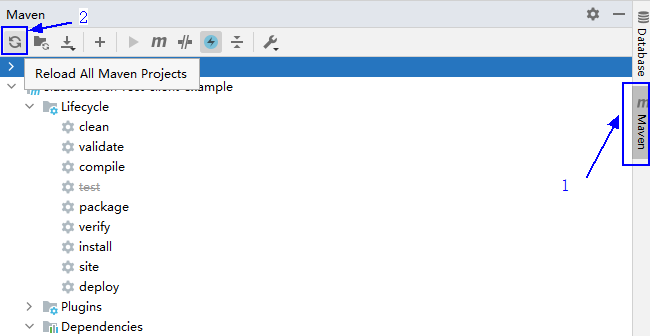
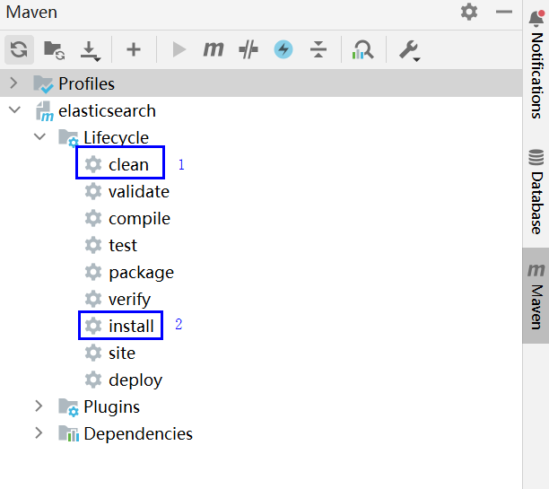
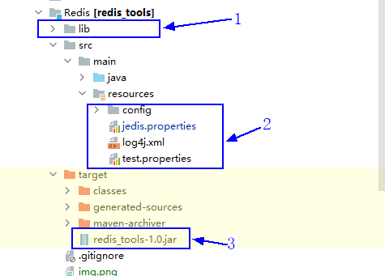

### 1.编译redis_tools，得到 redis_tools-1.0.jar
a.在IDEA右侧Maven窗口，单击`Reload All Maven Projects`进行Maven项目依赖导入。

b.依次双击`clean`和`install`，运行`maven clean`和`maven install`命令，输出`Build Success`表示编译成功。
  
### 2.获取Redis性能测试工具  
a.将如下3个部分上传到客户端节点上，例如上传到`/opt/redis_tool`目录  
  

b.设置权限
```
cd /opt/redis_tools/  
chmod 777 -R *
```
    