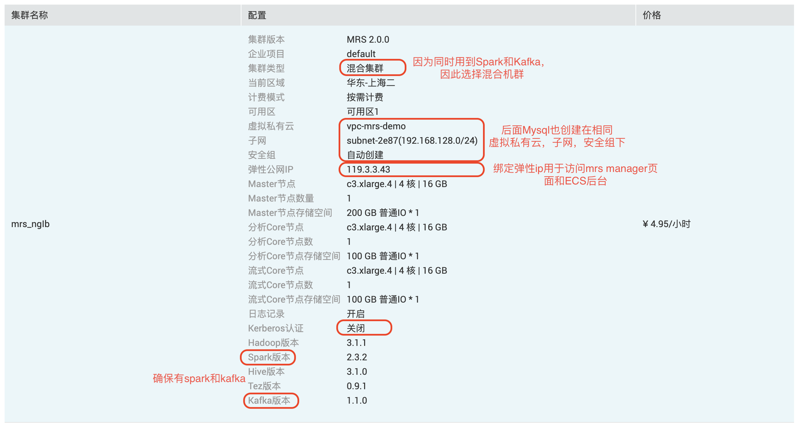
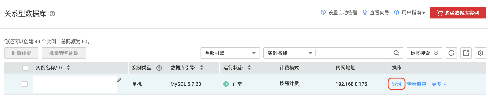
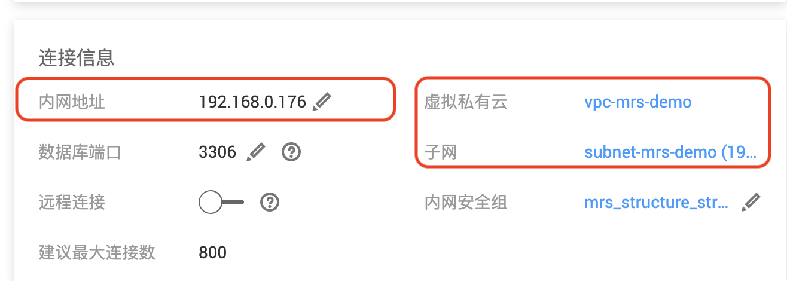
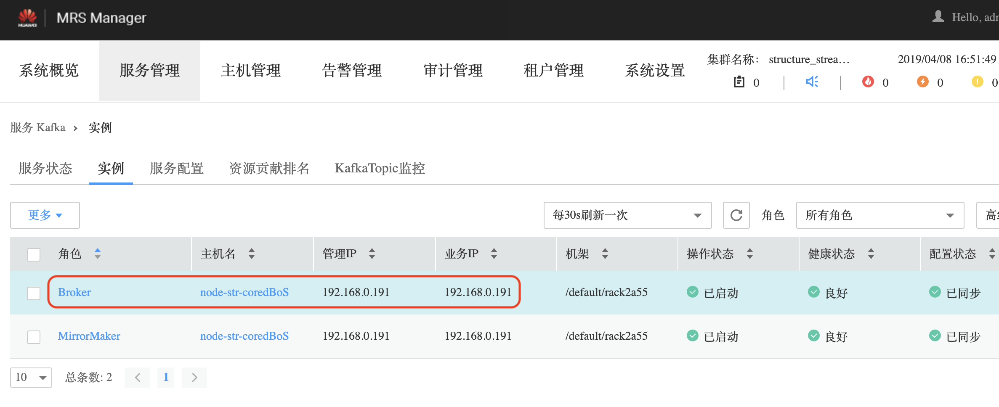
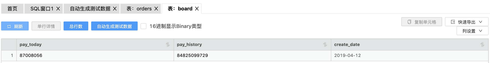
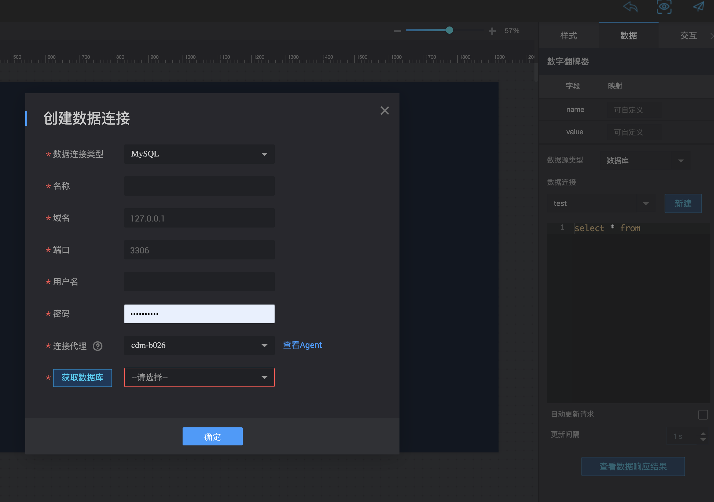

# 0. 介绍
本Demo以计算今日/历史支付流水为例，展示Spark大数据流处理，在实时大屏场景下的典型应用，最终的效果图可以参考[这里](https://console.huaweicloud.com/dlvapp/screen.html?share=051cc6801f884121a691030b0503a007&locale=zh-cn)。

演示如何利用Maxwell工具读取解析mysql binlog，并导入至kafka，再通过Spark Structured Streaming程序分析后，写到Mysql表，并用华为云DLV服务展示。

[Spark structured streaming](https://spark.apache.org/docs/2.3.2/structured-streaming-programming-guide.html)是Spark 2.0版本中推出的，基于Spark SQL引擎构建的流处理引擎，可以编写SQL进行流处理。

涉及服务:
1. [MRS](https://www.huaweicloud.com/product/mrs.html): 云上大数据服务，本例中用于运行Spark streaming程序，以及运行maxwell进程；
2. [RDS](https://www.huaweicloud.com/product/mysql.html): 云上数据库服务，本例中作为Mysql使用；
3. [DLV](https://www.huaweicloud.com/product/dlv.html): 云上可视化展现的服务，本例中用于最终的大屏展示。
4. [CDM](): 由于DLV必须通过CDM agent才能从数据源读取数据，因此还需要依赖CDM服务。


整个demo的数据流入下图所示：


1. 利用部署在MRS master节点的maxwell工具，从Mysql读取binlog，解析后写入Kafka；
2. 利用Spark streaming程序读取Kafka数据，计算后输出到Mysql中。某些场景（比如计算历史总流水）下，需要先从Mysql读取一次数据；
3. DLV通过CDM Agent读取Mysql数据用于大屏展示。


# 1.准备工作
按本教程完成demo的搭建，至少需要拥有一个MRS**混合**集群，一个RDS的Mysql实例，并申请开通DLV服务。其中DLV服务目前正在公测中，申请后即可免费使用。

## 创建MRS混合集群
参考下图配置，创建一个MRS**混合**集群，按本指导操作时请关闭Kerberos认证。


## 创建RDS实例
在相同的区域（Region）创建一个Mysql类型的RDS实例，请注意`虚拟私有云`，`子网`，`安全组`均选择与MRS相同。当然也可以在MRS的master节点自己搭建一个Mysql。

## 创建CDM集群
在相同的区域（Region）创建一个CDM集群，选择小规格即课。

## 申请开通DLV服务
DLV服务目前处于公测阶段，需要申请后才能使用该服务。

# 2. 实现读取mysql binlog至Kafka


本节实现mysql到kafka的数据流，主要参考[如何基于binlog将MySQL中的数据同步到MRS集群中](https://bbs.huaweicloud.com/forum/forum.php?mod=viewthread&tid=16000&page=1&extra=#pid52437)一文进行配置。
由于使用的RDS已经开启了binlog，上文中说到修改`my.cnf`的操作无需进行。

## 2.1 在RDS实例，并进行如下配置，添加一个maxwell用户
参考下图，登录RDS实例，登录后，即可执行SQL；其他操作可以参考[RDS文档](https://support.huaweicloud.com/rds/index.html)


执行下面的SQL，创建Maxwell用户，设置密码，并赋予权限。下面的'XXXXXX'请替换成自己的密码。当然也可以使用数据库的root用户来操作，那可以跳过当前步骤。
```mysql
GRANT ALL on maxwell.* to 'maxwell'@'%' identified by 'XXXXXX';

GRANT SELECT, REPLICATION CLIENT, REPLICATION SLAVE on *.* to 'maxwell'@'%';

#这里要额外添加INSERT和Update权限。因为为了方便，我们仍然用maxwell用户写回数据库
GRANT INSERT,UPDATE on *.* to 'maxwell'@'%';
```

## 2.2 数据准备
在RDS中执行如下命令，创建一张订单表用于模拟业务数据，和一张board表作为streaming程序的结果表，用于展示。
```sql
CREATE DATABASE IF NOT EXISTS demo;

CREATE TABLE IF NOT EXISTS `demo`.`orders` (
`order_id` bigint  PRIMARY KEY,
`pay_amount` decimal (20, 0) DEFAULT NULL,
`user_id` bigint DEFAULT NULL,
`create_time` datetime  DEFAULT NULL
) ENGINE=InnoDB DEFAULT CHARSET=utf8mb4;

CREATE TABLE IF NOT EXISTS `demo`.`board` (
`pay_today` decimal (20, 0)  DEFAULT NULL,
`pay_history` decimal (20, 0) DEFAULT NULL,
`create_date` date  PRIMARY KEY
) ENGINE=InnoDB DEFAULT CHARSET=utf8mb4;

```

编译demo的java代码，编译后上传至MRS集群的master节点。利用DataGenerator类不断向表中插入数据。启动后可以去RDS上确认是否有数据不断插入。
```shell
source /opt/client/bigdata_env; nohup java -cp board-1.0-SNAPSHOT.jar com.huawei.mrs.demo.board.DataGenerator -i 0.3 1> /var/log/data_gen.log 2>&1 &
```


## 2.3 在MRS的Master节点安装并配置maxwell

配置时需要Kafka Broker信息和Mysql的链接信息。从MRS Manager页面获取Broker信息，端口是9092。


从RDS页面获取RDS信息。


整理后配置到maxwell的`config.properties`中
```shell
producer=kafka
kafka.bootstrap.servers=192.168.0.191:9092
kafka_topic=maxwell

# mysql login info
host=192.168.0.176
user=maxwell
password=Maxwell@123
```

配置完成后, 假设maxwell解压到了`/opt/maxwell`目录下，执行下面的命令启动maxwell，此时Kafka中应该不断有数据生成。
```shell
cd /opt/maxwell; nohup bin/maxwell 1>/var/log/maxwell.log 2>&1 &
```

使用`kafka-console-consumer`来查看kafka中是否有数据，确认数据流是否打通。(需要先确保前面的模拟数据在不断生成)
```shell
kafka-console-consumer.sh --topic maxwell --bootstrap-server "192.168.0.191:9092"
```

如果看到类似`{"database":"mysql","table":"test5","type":"insert","ts":1554715811,"xid":13707,"commit":true,"data":{"id":1}}`这个的打印，则已成功配置maxwell。

## 3. 在MRS集群运行Spark程序，进行实时处理分析


## 3.1 代码解读
目前推出的教程是java版的，但还是**推荐**大家使用`scala`语言来开发Spark应用程序，Spark的编程接口更丰富，本身语法也更精炼。本教程使用Java仅仅是为了降低不必要的使用门槛。


## 3.2 修改数据库及kafka配置
Kafka的连接信息写在`KafkaParam`类中，Mysql的连接信息写在`MysqlParams`类中，请修改成自己集群的配置。

## 3.3 编包运行
编包后，将包传到mrs的master节点，需要先执行`source /opt/client/bigdata_env;`初始化一些环境变量，可以把这个命令加入到`/etc/profile`中，这样就不需要每次执行。<be>
启动spark程序，开始处理kafka中的数据，结果写入board表。
```shell
spark-submit --jars "/opt/client/Spark/spark/jars/streamingClient010/*" --master yarn --deploy-mode cluster --class com.huawei.mrs.demo.board.JavaEntry --driver-class-path /root/board-1.0-SNAPSHOT.jar /root/board-1.0-SNAPSHOT.jar
```

去RDS页面查看输出表中是否有数据。


## 4. 配置DLV服务。
DLV是大屏展现的应用，配置相对简单，具体可以参考[DLV](https://www.huaweicloud.com/product/dlv.html)服务的文档。

新建一个大屏，从左边的`文本`组件中拖入一个`数字翻拍器`。
数据源类型改成数据库，点击新建连接，配置mysql的信息，注意这里的域名要配置mysql的弹性公网ip地址。连接代理选择此前创建的CDM集群。



